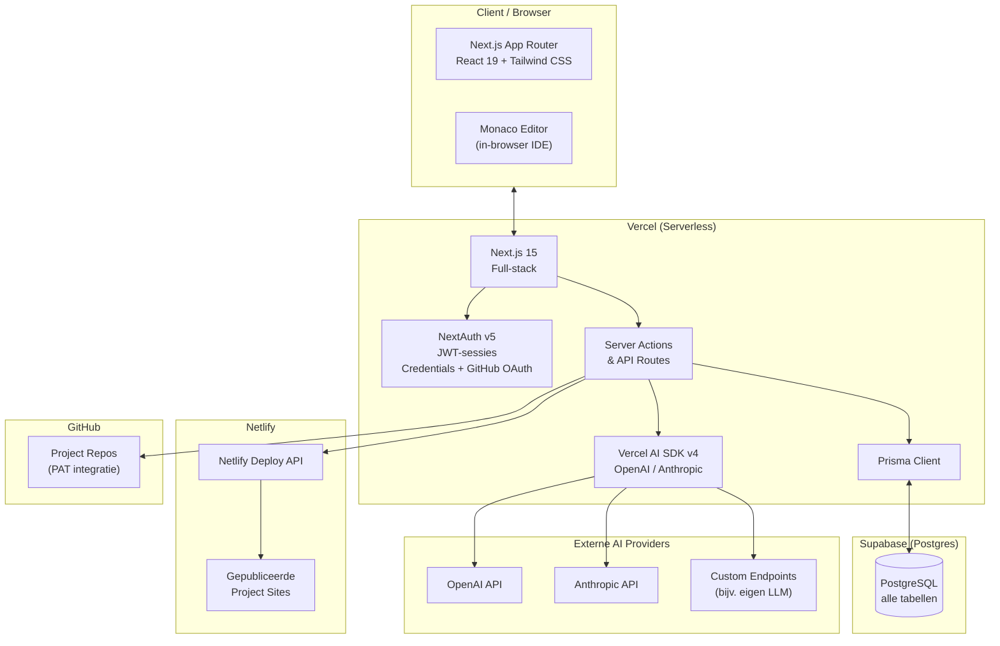
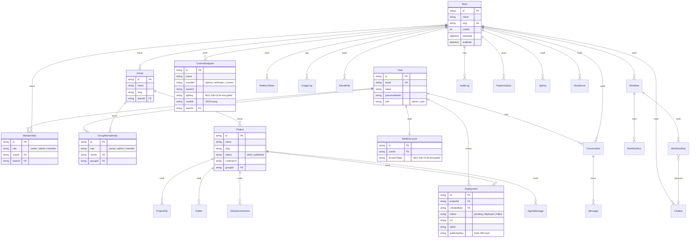
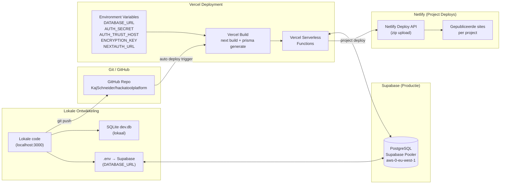
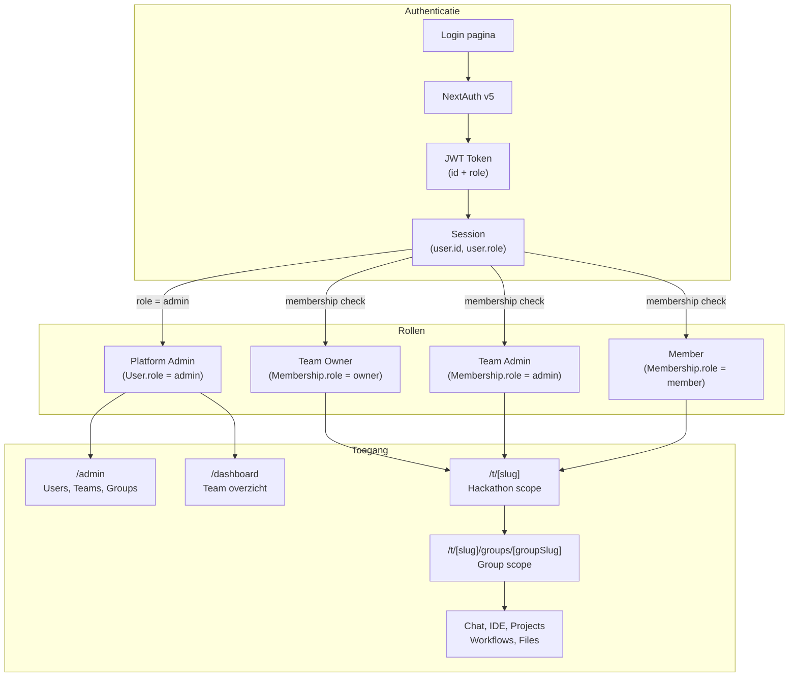
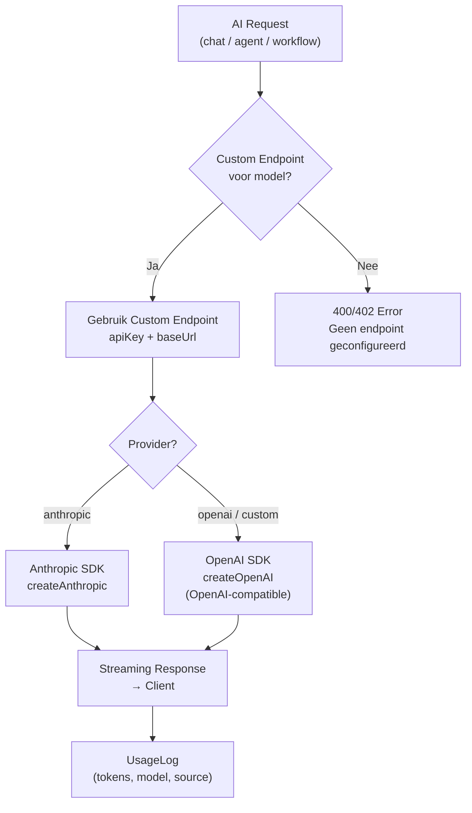

# Hackatool — Architectuur Diagrammen

## 1. Systeemoverzicht

```mermaid
graph TB
    subgraph Client["Client / Browser"]
        UI["Next.js App Router<br/>React 19 + Tailwind CSS"]
        IDE["Monaco Editor<br/>(in-browser IDE)"]
    end

    subgraph Vercel["Vercel (Serverless)"]
        NextApp["Next.js 15<br/>Full-stack"]
        NextAuth["NextAuth v5<br/>JWT-sessies<br/>Credentials + GitHub OAuth"]
        AISDK["Vercel AI SDK v4<br/>OpenAI / Anthropic"]
        ServerActions["Server Actions<br/>& API Routes"]
        PrismaClient["Prisma Client"]
    end

    subgraph Supabase["Supabase (Postgres)"]
        DB[("PostgreSQL<br/>alle tabellen")]
    end

    subgraph ExternalAI["Externe AI Providers"]
        OpenAI["OpenAI API"]
        Anthropic["Anthropic API"]
        Custom["Custom Endpoints<br/>(bijv. eigen LLM)"]
    end

    subgraph Netlify["Netlify"]
        NetlifyAPI["Netlify Deploy API"]
        NetlifySites["Gepubliceerde<br/>Project Sites"]
    end

    subgraph GitHub["GitHub"]
        GitHubRepos["Project Repos<br/>(PAT integratie)"]
    end

    Client <--> NextApp
    NextApp --> NextAuth
    NextApp --> ServerActions
    ServerActions --> PrismaClient
    PrismaClient <--> DB
    ServerActions --> AISDK
    AISDK --> OpenAI
    AISDK --> Anthropic
    AISDK --> Custom
    ServerActions --> NetlifyAPI
    NetlifyAPI --> NetlifySites
    ServerActions --> GitHubRepos
```

## 2. Database Schema (ERD)

```mermaid
erDiagram
    User ||--o{ Membership : "heeft"
    User ||--o{ GroupMembership : "heeft"
    User ||--o{ Conversation : "start"
    User ||--o{ Deployment : "creëert"
    User ||--o| NetlifyAccount : "heeft"

    Team ||--o{ Membership : "bevat"
    Team ||--o{ Group : "bevat"
    Team ||--o{ CustomEndpoint : "heeft"
    Team ||--o{ PlatformToken : "heeft"
    Team ||--o{ Conversation : "heeft"
    Team ||--o{ UsageLog : "logt"
    Team ||--o{ StoredFile : "heeft"
    Team ||--o{ Chatbot : "heeft"
    Team ||--o{ Workflow : "heeft"
    Team ||--o{ AuditLog : "logt"
    Team ||--o{ TeamInvitation : "stuurt"
    Team ||--o{ ApiKey : "heeft"
    Team ||--o{ McpServer : "heeft"

    Group ||--o{ GroupMembership : "bevat"
    Group ||--o{ Project : "bevat"

    Project ||--o{ ProjectFile : "heeft"
    Project ||--o{ Folder : "heeft"
    Project ||--o{ GitHubConnection : "heeft"
    Project ||--o{ Deployment : "heeft"
    Project ||--o{ AgentMessage : "heeft"

    Conversation ||--o{ Message : "bevat"

    Workflow ||--o{ WorkflowStep : "heeft"
    Workflow ||--o{ WorkflowRun : "heeft"
    WorkflowStep }o--o| Chatbot : "optioneel"

    User {
        string id PK
        string email UK
        string name
        string passwordHash
        string role "admin | user"
    }

    Team {
        string id PK
        string name
        string slug UK
        int credits
        datetime startDate
        datetime endDate
    }

    Group {
        string id PK
        string name
        string slug
        string teamId FK
    }

    Membership {
        string id PK
        string role "owner | admin | member"
        string userId FK
        string teamId FK
    }

    GroupMembership {
        string id PK
        string role "owner | admin | member"
        string userId FK
        string groupId FK
    }

    CustomEndpoint {
        string id PK
        string name
        string provider "openai | anthropic | custom"
        string baseUrl
        string apiKey "AES-256-GCM encrypted"
        string models "JSON array"
        string teamId FK
    }

    Project {
        string id PK
        string name
        string slug
        string status "draft | published"
        string runtimeUrl
        string groupId FK
    }

    Deployment {
        string id PK
        string projectId FK
        string createdById FK
        string status "pending | deployed | failed"
        string url
        string siteId
        string publicApiKey "SHA-256 hash"
    }

    NetlifyAccount {
        string id PK
        string userId FK
        string accessToken "AES-256-GCM encrypted"
    }
```

## 3. Deploy Flow

```mermaid
flowchart LR
    subgraph Dev["Lokale Ontwikkeling"]
        LocalCode["Lokale code<br/>(localhost:3000)"]
        LocalDB["SQLite dev.db<br/>(lokaal)"]
        EnvFile[".env → Supabase<br/>(DATABASE_URL)"]
    end

    subgraph Git["Git / GitHub"]
        Repo["GitHub Repo<br/>KajSchneider/hackatoolplatform"]
    end

    subgraph VercelDeploy["Vercel Deployment"]
        Build["Vercel Build<br/>next build + prisma generate"]
        VercelEnv["Environment Variables<br/>DATABASE_URL<br/>AUTH_SECRET<br/>AUTH_TRUST_HOST<br/>ENCRYPTION_KEY<br/>NEXTAUTH_URL"]
        Serverless["Vercel Serverless<br/>Functions"]
    end

    subgraph SupabaseProd["Supabase (Productie)"]
        ProdDB[("PostgreSQL<br/>Supabase Pooler<br/>aws-0-eu-west-1")]
    end

    subgraph NetlifyDeploy["Netlify (Project Deploys)"]
        NetlifyBuild["Netlify Deploy API<br/>(zip upload)"]
        PublishedSites["Gepubliceerde sites<br/>per project"]
    end

    LocalCode -->|git push| Repo
    Repo -->|auto deploy trigger| Build
    VercelEnv --> Build
    Build --> Serverless
    Serverless <--> ProdDB
    LocalCode --> LocalDB
    LocalCode --> EnvFile
    EnvFile <--> ProdDB
    Serverless -->|project deploy| NetlifyBuild
    NetlifyBuild --> PublishedSites
```

## 4. Auth & Multi-tenant Flow

```mermaid
flowchart TB
    subgraph Auth["Authenticatie"]
        Login["Login pagina"]
        NextAuth["NextAuth v5"]
        JWT["JWT Token<br/>(id + role)"]
        Session["Session<br/>(user.id, user.role)"]
    end

    subgraph Roles["Rollen"]
        PlatformAdmin["Platform Admin<br/>(User.role = admin)"]
        TeamOwner["Team Owner<br/>(Membership.role = owner)"]
        TeamAdmin["Team Admin<br/>(Membership.role = admin)"]
        Member["Member<br/>(Membership.role = member)"]
    end

    subgraph Access["Toegang"]
        AdminUI["/admin<br/>Users, Teams, Groups"]
        Dashboard["/dashboard<br/>Team overzicht"]
        TeamScope["/t/[slug]<br/>Hackathon scope"]
        GroupScope["/t/[slug]/groups/[groupSlug]<br/>Group scope"]
        Chat["Chat, IDE, Projects<br/>Workflows, Files"]
    end

    Login --> NextAuth
    NextAuth --> JWT
    JWT --> Session

    Session -->|role = admin| PlatformAdmin
    Session -->|membership check| TeamOwner
    Session -->|membership check| TeamAdmin
    Session -->|membership check| Member

    PlatformAdmin --> AdminUI
    PlatformAdmin --> Dashboard
    TeamOwner --> TeamScope
    TeamAdmin --> TeamScope
    Member --> TeamScope

    TeamScope --> GroupScope
    GroupScope --> Chat
```

## 5. AI Model Resolutie

```mermaid
flowchart TD
    Request["AI Request<br/>(chat / agent / workflow)"]
    CheckEndpoint{"Custom Endpoint<br/>voor model?"}
    UseEndpoint["Gebruik Custom Endpoint<br/>apiKey + baseUrl"]
    CheckProvider{"Provider?"}
    UseAnthropic["Anthropic SDK<br/>createAnthropic"]
    UseOpenAI["OpenAI SDK<br/>createOpenAI<br/>(OpenAI-compatible)"]
    StreamResponse["Streaming Response<br/>→ Client"]
    LogUsage["UsageLog<br/>(tokens, model, source)"]

    Request --> CheckEndpoint
    CheckEndpoint -->|Ja| UseEndpoint
    UseEndpoint --> CheckProvider
    CheckProvider -->|anthropic| UseAnthropic
    CheckProvider -->|openai / custom| UseOpenAI
    UseAnthropic --> StreamResponse
    UseOpenAI --> StreamResponse
    StreamResponse --> LogUsage
    CheckEndpoint -->|Nee| Error["400/402 Error<br/>Geen endpoint geconfigureerd"]
```
